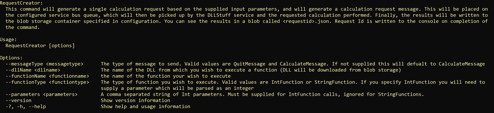
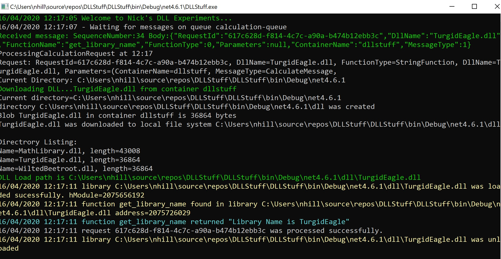

# DLLStuff

This is the result of investigation that one of my colleagues asked me to look into.  

In essence can I create a utility that
* can accept an command message
* dynamically load a function from a DLL (both specified in the message)
* execute the function with parameters passed in the message.  
* can be containerised
* can be hosted on a number of container related platforms?

The answer to all the questions above is a resounding **YES**, but unfortunately the preferred container hosting platfrom is Azure Container Instances, and there is a little glitch there at the moment (that should be resolved very soon). 

This repo contains everything you need to get you own example up and running...

## Introduction

I haven't fully automated the deployment of this (I dont think enough people will want o try it to warrant that).  The remainder of this page should give you enough pointers to deploy it if you want to.

## Building the application

Clone/fork this repo and open the solution in Visual Studio (2019).  Ensure that the solution builds.

## Preparing to run locally

In your azure subscription:
* create a storage account with a container to hold inputs and results.  Note the connection string and container name
* create a service bus namespace and a queue within the namespace. Note the connection string and the queue name
* Add a file called local.settings.json in DLLStuff and RequestCreator projects

`{
  "Logging": {
    "LogLevel": {
      "Default": "Warning"
    }
  },
  "StorageConnectionString": "",
  "ServiceBusConnectionString": ""`
  
*ensure this file is excluded from source control and copied to the output directory on build*

* In settings.json in the RequestCreator project configure the container and queue that you created above
`{
  "ContainerName": "dllstuff",
  "ServiceBusQueueName": "calculation-queue"
}`

Upload the two native 32-bit DLLs (DLLStuff\dll?) that I developed for this exercise from your local drive to the container you created above.

* TurgidEagle.dll
* WiltedBeetroot.dll

The source code for these DLLs can be found [here](https://github.com/nikkh/TurgidEagle/tree/master/TurgidEagle) and [here](https://github.com/nikkh/WiltedBeetroot)

These are analagous to the model DLLs generated by modelling tools.  Note that the dependencies for the DLLs (ucrtbased.dll and vcruntime140d.dll) are stored in the root of the DLLStuff application and will be deployed along with it.

## Running locally

Change to the directory where the built RequestCreator.exe file is stored (DLLStuff\RequestCreator\bin\debug?) and run RequestCreator -h.  This will give you a description of the command:

This command will generate a single calculation request based on the supplied input parameters, and will generate a calculation request message. This will be placed on
  the configured service bus queue, which will then be picked up by the DLLStuff service and the requested calculation performed. Finally, the results will be written to
  the blob storage container specified in configuration. You can see the results in a blob called <requestid>.json. Request Id is written to the console on completion of
  the command.

Each time you run RequestCreator you supply parameters.  The combination of parameters you supply will lead tot he generation of a CalculationRequestMessage, which will be placed on the service bus queue and picked up by the processing engine.  The parameters are described briefly below:

--messageType <messagetype>      The type of message to send. Valid values are QuitMessage and CalculateMessage. If not supplied this will default to CalculateMessage
  
  --dllName <dllname>              The name of the DLL from which you wish to execute a function (DLL will be downloaded from blob storage)
  
  --functionName <functionname>    the name of the function your wish to execute
  
  --functionType <functiontype>    The type of function you wish to execute. Valid values are IntFunction or StringFunction. If you specify IntFunction you will need to supply a parameter which will be parsed as an integer
  
  --parameters <parameters>        A comma separated string of Int parameters. Must be supplied for IntFunction calls, ignored for StringFunctions.
  
Each DLL contains two functions.  They both contain a function that returns a string called get_library_name.  WiltedBeetroot contains a function called calculate_Cube which accepts and int and treturns the cube of the int.  TurgidEagle has a calculate_square function that returns the square of the inout.

The following commands will generate requests for each method in turn:

* RequestCreator --dllName WiltedBeetroot.dll --functionName calculate_cube --functionType IntFunction --parameters 4
* RequestCreator --dllName WiltedBeetroot.dll --functionName get_library_name --functionType StringFunction
* RequestCreator --dllName TurgidEagle.dll --functionName get_library_name --functionType StringFunction
* RequestCreator --dllName TurgidEagle.dll --functionName calculate_square --functionType IntFunction --parameters 9

If you now run the DLLStuff project, you should see your messages being processed:

  
## Creating a container

You will need [Docker Desktop](https://hub.docker.com/editions/community/docker-ce-desktop-windows?tab=description) installed for this.

Since the whole point of the activity is to check dynamic loading of 32-bit DLLs running in containers in Azure, then the next step is to create a container. (A dockerfile would be pretty easy for this, but I wanted to do everyhting manually so I'd understand any pitfalls.  Consequently I have been creating my container using the following steps:

* docker pull mcr.microsoft.com/dotnet/framework/runtime:4.8-windowsservercore-ltsc2019
* docker run --entrypoint powershell.exe -v C:\Users\nhill\source\repos\DLLStuff\:c:\data -it  mcr.microsoft.com/dotnet/framework/runtime:4.8-windowsservercore-ltsc2019
* PS C:\data\dllstuff\bin\debug\net4.6.1> copy &ast;.&ast; C:\
* PS Exit
* docker ps -a
* docker stop hardcore_robinson
* docker commit hardcore_robinson dllstuff:hardcore_robinson
* docker run --entrypoint dllstuff.exe -it  dllstuff:hardcore_robinson
* docker tag dllstuff:hardcore_robinson dllstuffacr.azurecr.io/dllstuff:hardcore_robinson
* docker push dllstuffacr.azurecr.io/dllstuff:hardcore_robinson

What I'm essentially doing here is pulling an image that is both supported on Azure Container Instances, and also has the right components installed to run a .NET framework application.  I think start a container from that image - mapping the folder with my DLLStuff application to c:\data in the container.  I access the container with powershell.  I copy the application (and all its dependencies) into the container, then quit.

Then I look for all docker containers, and find the one I just accesssed.  I then stop and commit that container and tag it with its docker generated name. Then, I run the application in the container to make sure it works, and push to my Azure Container Registry (you will need to create this, enable admin user and note the password - you will be asked to enter your credentials).

## Deploy to ACI

> At the time of writing the DLLStuff.exe wont run in ACI.  It just fails silently.  This is because of [this KB](https://support.microsoft.com/en-sg/help/4542617/you-might-encounter-issues-when-using-windows-server-containers-with-t).  There's nothing you can do to work around this really, but it should be resolved imminently.

`az container create --resource-group dllstuff  --name hardcore-robinson  --image dllstuffacr.azurecr.io/dllstuff:hardcore_robinson  --os-type windows --command-line "DLLStuff.exe" --restart-policy OnFailure --no-wait`

You container will restart repeatedly, but you wont be able to access it.  In order to create an ACI you can access (and then attempt torun DLLStuff.exe manually) you can use: `--command-line "ping -t localhost" `.  Currently if you do this it will silently fail.

## Create an AKS cluster with support for Windows
Due to the above problem with ACI, I decided to deploy to AKS.  Here are the commands to create a windows capable AKS cluster:

* az extension add --name aks-preview
* az extension update --name aks-preview
* az feature register --name WindowsPreview --namespace Microsoft.ContainerService
* az feature list -o table --query "[?contains(name, 'Microsoft.ContainerService/WindowsPreview')].{Name:name,State:properties.state}"
*You need to wait for completion here*

* az provider register --namespace Microsoft.ContainerService
* az group create --name winakstest --location eastus
* PASSWORD_WIN="<redacted>"
* az aks create     --resource-group winakstest     --name myAKSCluster     --node-count 2     --enable-addons monitoring     --kubernetes-version 1.15.7     --generate-ssh-keys     --windows-admin-password $PASSWORD_WIN     --windows-admin-username azureuser     --vm-set-type VirtualMachineScaleSets     --load-balancer-sku standard     --network-plugin azure
* az aks nodepool add     --resource-group winakstest     --cluster-name myAKSCluster     --os-type Windows     --name npwin     --node-count 1     --kubernetes-version 1.15.7
*link your azure container registry to your cluster*
* az aks update -n myAKSCluster -g winakstest --attach-acr dllstuffacr

## Deploy your application to your AKS Cluster
* az aks get-credentials --resource-group winakstest --name myAKSCluster
* kubectl apply -f hardcorerobinson.yaml
* kubectl get pods
* kubectl logs hardcorerobinson-deployment-d66c95d87-jrk78

the yaml file I used looks like this:

apiVersion: apps/v1
kind: Deployment
metadata:
  name: hardcorerobinson-deployment
  labels:
    app: hardcorerobinson-deployment
spec:
  replicas: 1
  selector:
    matchLabels:
      app: hardcorerobinson
  template:
    metadata:
      labels:
        app: hardcorerobinson
    spec:
      nodeSelector:
        "beta.kubernetes.io/os": windows
      containers:
      - name: hardcorerobinson
        image: dllstuffacr.azurecr.io/dllstuff:hardcore_robinson
        command:
        - DLLStuff.exe
      restartPolicy: Always

And I have checked it in [here](https://github.com/nikkh/DLLStuff/blob/master/DLLStuff/hardcorerobinson.yaml)

## Summary

It is indeed possible to run an application that dynamically loads and unmanaged DLL in a container on Azure.  At present DLLStuff runs indefinitely (until you send a QuitMessage via RequestCreator).  This would incur charges even when it isnt doing anything.  Ideally, I would like to have the service bus message monitored by an azure function which starts an ACI instance on request, but I cant do this right now.
